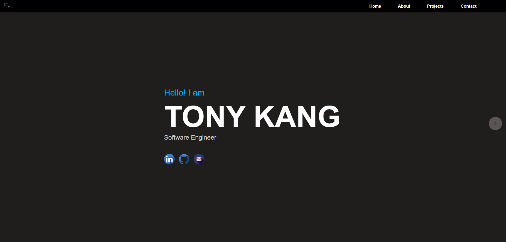
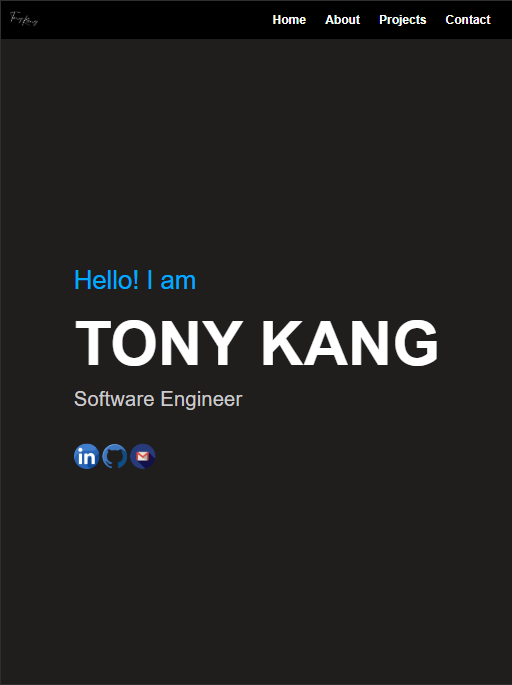
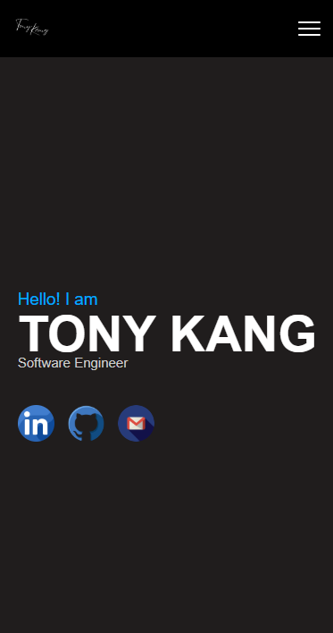
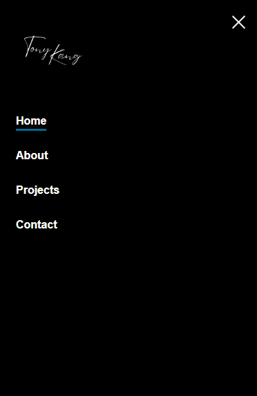
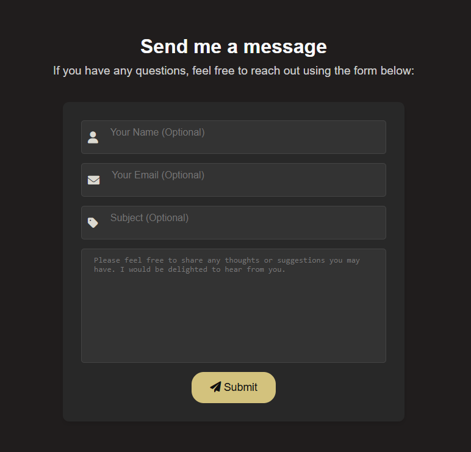

# Tony's Personal Website

This repository contains the source code for my personal website, built with React. This website serves as my online portfolio and a platform to showcase my skills and projects.

**Check out the live website: [https://ynot1996.github.io/personal-website/](https://ynot1996.github.io/personal-website/)**


## Technologies Used

* **Front-end:** React, Styled-Components, React Router
* **Back-end:** Node.js
* **Deployment:** Render, GitHub Pages

## Features

This website offers the following features:

*   **Responsive Design:** 

📱 Built using CSS media queries and flexible layouts to ensure an optimal viewing experience on all devices, from desktops to tablets and smartphones.
    


*   **Interactive Elements:** 

🖱️ Engage with interactive components, such as the animated hamburger menu for navigation on mobile devices, smooth scrolling, and hover effects.
    


*   **Contact Form:** 

✉️ A fully functional contact form that validates user input and sends messages to my email address, powered by a Node.js backend.
    


*   **Modern Technologies:** 

🚀 Built using modern web technologies like React, Styled-Components, and React Router for a performant and maintainable website.

## Getting Started

To run this project locally, follow these steps:

1.  **Clone the repository:**

    ```bash
    git clone [https://github.com/Ynot1996/personal-website.git](https://github.com/Ynot1996/personal-website.git)
    ```

2.  **Navigate to the project directory:**

    ```bash
    cd personal-website
    ```

3.  **Install dependencies:**

    ```bash
    npm install
    ```

4.  **Start the development server:**

    ```bash
    npm start
    ```

The website will be accessible at `http://localhost:3000` in your browser.

**Note:** This project requires Node.js version 22.12.0 or higher.

## Build & Deployment

1.  **Build the project:**

    ```bash
    npm run build
    ```

    This will create an optimized production build in the `build` directory.

2.  **Deployment:**
    *   **GitHub Pages:** The website is deployed to GitHub Pages through a GitHub Actions workflow that automatically builds and deploys the `build` directory to the `gh-pages` branch.
    *   **Render:** The backend (`contact-backend`) is deployed to Render.
        *   **Environment Variables:**
            *   `EMAIL_USER`: Your Gmail address used for sending emails.
            *   `EMAIL_PASS`: Your Gmail App Password.
            *   `EMAIL_RECEIVER`: Your email address where you want to receive the contact form submissions.

            **Note:** To set up these environment variables in Render, go to your Render dashboard, select your service, navigate to the "Environment" tab, and add the variables there. **For security, remember to generate an App Password for your Gmail account instead of using your regular password.** You can create an App Password in your Google Account's security settings.
