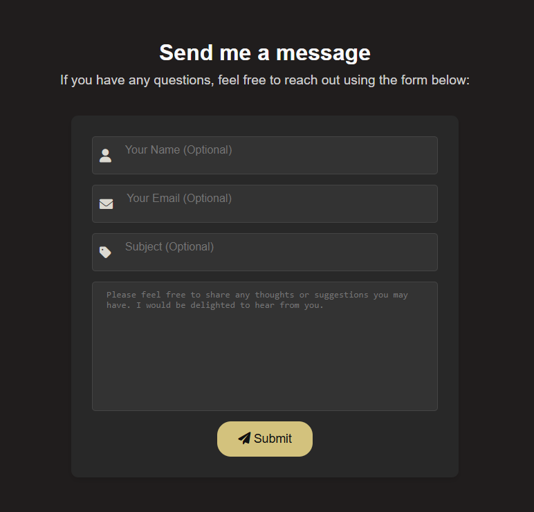

# Personal Website

This repository contains the source code for my personal website, built with React. This website serves as my online portfolio and a platform to showcase my skills and projects.

**Check out the live website: [https://ynot1996.github.io/personal-website/](https://ynot1996.github.io/personal-website/)**


## About Me

Developer with a passion for building user-friendly and performant web applications using React. 
Seeking opportunities to contribute to innovative projects and expand my skills in full-stack development. 

## Skills

*   **Frontend:** React, Styled-Components, HTML, CSS, JavaScript, Responsive Design
*   **Backend:** Node.js
*   **Cloud:** GCP (Compute Engine), AWS (EC2)
*   **DevOps:** Linux (CLI), Version Control (Git), SSH
*   **Databases:** MySQL
*   **Tools/Libraries:** Python (Web Scraping with Libraries like Beautiful Soup, Requests)

## Features

This website offers the following features:

*   **Responsive Design:** 📱 Built using CSS media queries and flexible layouts to ensure an optimal viewing experience on all devices, from desktops to tablets and smartphones.
    (./assets/images/responsive2.png)(./assets/images/responsive3.png)

*   **Interactive Elements:** 🖱️ Engage with interactive components, such as the animated hamburger menu for navigation on mobile devices, smooth scrolling, and hover effects.
    (./assets/images/menu2.png)

*   **Contact Form:** ✉️ A fully functional contact form that validates user input and sends messages to my email address, powered by a Node.js backend.
    

*   **Modern Technologies:** 🚀 Built using modern web technologies like React, Styled-Components, and React Router for a performant and maintainable website.

## Project Structure

personal-website/
├── .github/             # GitHub Actions workflows
├── .vscode/             # VS Code settings
├── build/               # Production build output
├── contact-backend/     # Node.js backend for contact form
├── node_modules/        # Project dependencies
├── public/              # Static assets
│   └── assets/
│       ├── images/      # Images used in the website and README
│       └── icons/       # Icons used in the website 
├── src/                 # Source code for the React application
├── .gitignore           # Files and folders to be ignored by Git
├── LICENSE              # Project license
├── package-lock.json    # Detailed dependency tree
├── package.json         # Project metadata and scripts
└── README.md            # Project documentation

## Getting Started

To run this project locally, follow these steps:

1.  **Clone the repository:**

    ```bash
    git clone [https://github.com/Ynot1996/personal-website.git](https://github.com/Ynot1996/personal-website.git)
    ```

2.  **Navigate to the project directory:**

    ```bash
    cd personal-website
    ```

3.  **Install dependencies:**

    ```bash
    npm install
    ```

4.  **Start the development server:**

    ```bash
    npm start
    ```

The website will be accessible at `http://localhost:3000` in your browser.

**Note:** This project requires Node.js version 22.12.0 or higher.

## Build & Deployment

1.  **Build the project:**

    ```bash
    npm run build
    ```

    This will create an optimized production build in the `build` directory.

2.  **Deployment:**
    *   **GitHub Pages:** The website is deployed to GitHub Pages through a GitHub Actions workflow that automatically builds and deploys the `build` directory to the `gh-pages` branch.
    *   **Render:** The backend (`contact-backend`) is deployed to Render.
        *   **Environment Variables:**
            *   `EMAIL_USER`: Your Gmail address used for sending emails.
            *   `EMAIL_PASS`: Your Gmail App Password.
            *   `EMAIL_RECEIVER`: Your email address where you want to receive the contact form submissions.

            **Note:** To set up these environment variables in Render, go to your Render dashboard, select your service, navigate to the "Environment" tab, and add the variables there. **For security, remember to generate an App Password for your Gmail account instead of using your regular password.** You can create an App Password in your Google Account's security settings.

## Technologies Used

* **Front-end:** React, Styled-Components, React Router
* **Back-end:** Node.js
* **Deployment:** Render, GitHub Pages

## Contributing

Contributions are welcome! If you find any bugs or have suggestions for improvements, please feel free to open an issue or submit a pull request.

## License

This project is licensed under the MIT License - see the [LICENSE](LICENSE) file for details.

## Future Roadmap
- **Project Showcase:** Add a dedicated section to highlight my projects with detailed descriptions and links.
- **Blog Integration:** Integrate a blog section to share my thoughts and experiences in web development.

---

**Remember to:**

1.  **Replace the placeholder image URLs** with the actual paths to your screenshots and GIFs.
2.  **Add the technology logos** to your `public/assets/images` folder and update their paths in the README.
3.  **Create an App Password** for your Gmail account and configure the environment variables in your Render dashboard.

This improved README provides a comprehensive overview of your project, making it easier for others to understand and engage with your work!
